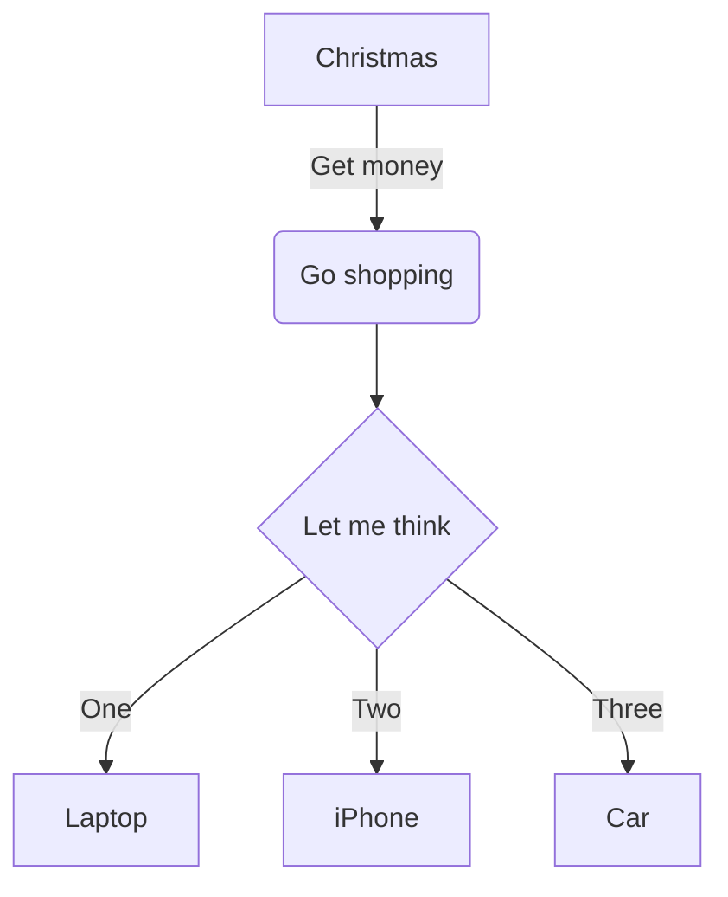

## 这个是 table
一些表格的参考语法：
```table
类别 | 名称
姓氏(h2) | ~
陈 | 章
```

```table
类别 |  名称
颜色(v2) | 红色
~ |  黄色
```

```table
   类别      |   名称
颜色(v2)    |   红色
     ~        |   黄色
姓氏(v2)    |    张  
     ~        |    王  
姓氏(h2)
    陈        |    章  
```

```table:bar
    季度        |   衬衫   |   羊毛衫   |   雪纺衫   |   裤子   |   高跟鞋   |   袜子
    1季度       |    5     |    20     |    36     |   10    |    10     |   21 
    2季度       |    15    |    20     |     6     |   10    |    10     |   30 
3季度上(3季度)   |    2     |     2     |    16     |    8    |     6     |   30 
3季度下(3季度)   |    5     |     2     |    13     |   10    |     9     |   20 
```

- - - - - - - - - - - - - - - - - - - - 

## 其它

